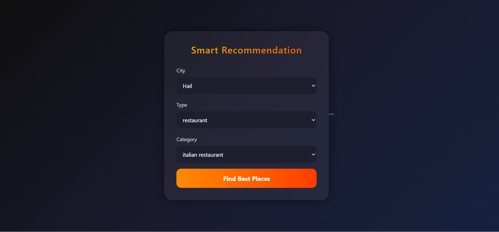

# Smart Recommendation System API

🚀 Live Demo:
https://smart-recommendation-system-bfau.onrender.com

📂 GitHub Repository:
https://github.com/Ziyad28/smart-recommendation-system

## Preview


AI-based recommendation system that suggests the best **restaurants** and **coffee shops** based on ratings and reviews.

## 🚀 Features

* Restaurant recommendations
* Coffee shop recommendations
* Rating-based ranking system
* Google Maps integration
* REST API built with Spring Boot

## 🛠 Technologies

* Java
* Spring Boot
* REST API
* HTML / CSS / JavaScript

## 📊 How It Works

The system analyzes ratings and number of reviews to calculate a score and recommend the best places in each category.

Score formula:

```
score = rating + min(reviews / 1000, 1)
```

This helps balance **rating quality** with **review popularity**.

## 🌍 Example Categories

* Italian Restaurants
* American Restaurants
* Japanese Restaurants
* Saudi Restaurants
* Shawarma Restaurants
* Specialty Coffee
* Coffee Roasteries

## 📍 Cities Supported

* Hail
* Riyadh
* Dammam

## 🔗 API Example

Example request:

```
POST /recommend
```

Example body:

```json
{
 "city": "Riyadh",
 "type": "coffee",
 "category": "specialty coffee"
}
```

Example response:

```json
{
 "places": [
   {
     "name": "Brew92",
     "rating": 4.0,
     "reviews": 3303
   }
 ]
}
```

## 👨‍💻 Author

Ziyad Alghadhban
Software Engineering Student
