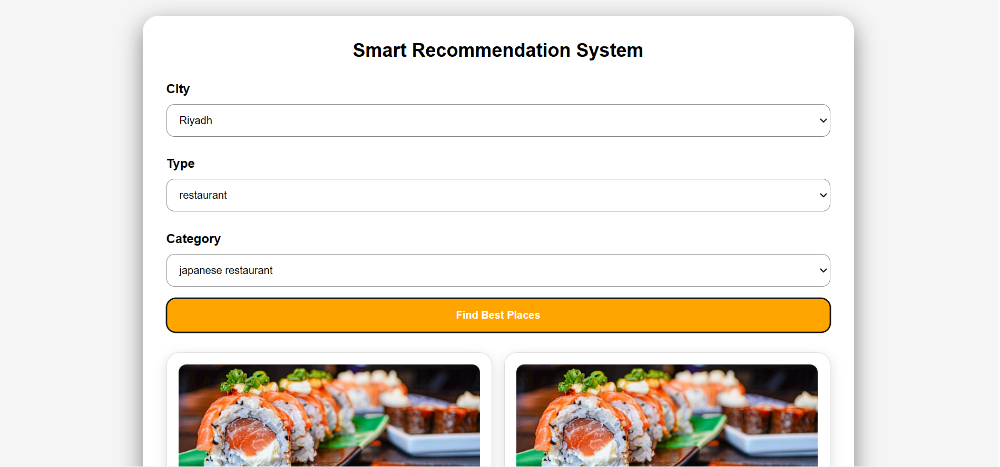

# Smart Recommendation System

🚀 **Live Demo:**
https://smart-recommendation-system-bfau.onrender.com

📂 **GitHub Repository:**
https://github.com/Ziyad28/smart-recommendation-system

---

## 📸 Preview



Modern web interface that provides smart restaurant and coffee shop recommendations.

---

## 🧠 About the Project

An AI-based recommendation system that suggests the best **restaurants** and **coffee shops** based on ratings and number of reviews.

---

## 🚀 Features

* Restaurant recommendations
* Coffee shop recommendations
* Smart ranking system (based on rating and reviews)
* Top 3 recommendations (Best Match 🥇, Second 🥈, Third 🥉)
* Google Maps-based data
* REST API built with Spring Boot
* Clean and modern user interface

---

## 🛠 Technologies

* Java
* Spring Boot
* REST API
* HTML
* CSS
* JavaScript

---

## 📊 How It Works

The system calculates a score for each place using:

```java
score = rating + Math.min(reviews / 1000.0, 1);
```

This approach balances between:

* ⭐ High rating (quality)
* 📈 High number of reviews (popularity)

---

## 🌍 Supported Categories

* Italian Restaurants
* American Restaurants
* Japanese Restaurants
* Saudi Restaurants
* Shawarma Restaurants
* Specialty Coffee
* Coffee Roasteries

---

## 📍 Supported Cities

* Hail
* Riyadh
* Dammam

---

## 🔗 API Example

### Request

POST /api/recommend

Body:

```json
{
  "city": "Riyadh",
  "type": "coffee",
  "category": "specialty coffee"
}
```

### Response (200 OK)

```json
{
  "places": [
    {
      "name": "Brew92",
      "rating": 4.0,
      "reviews": 3303
    }
  ]
}
```

---

## 👨‍💻 Author

Ziyad Alghadhban
Software Engineering Student
